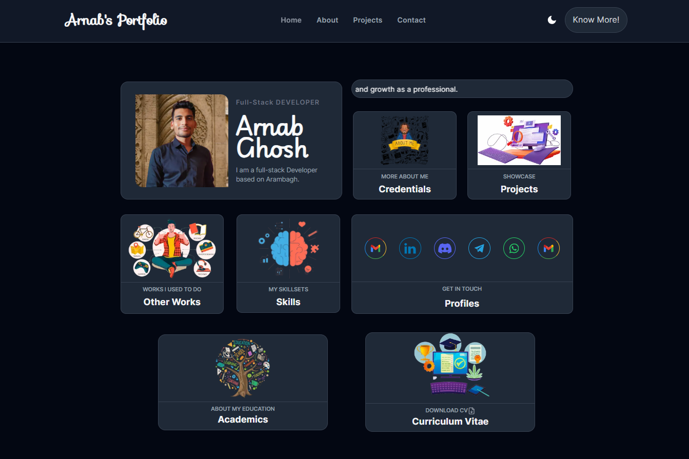

# Portfolio

Welcome to my portfolio! This website showcases my projects, skills, and experiences as a software developer.

## Table of Contents

- [Introduction](#introduction)
- [Features](#features)
- [Technologies Used](#technologies-used)
- [Usage](#usage)
- [Screenshots](#screenshots)
- [Project Structure](#project-structure)
- [Contact](#contact)

## Introduction

This portfolio website serves as a personal showcase for my work and skills in web development. It highlights my proficiency in various technologies and provides a detailed overview of the projects I have completed.

## Features

- Home: An introduction to who I am and what I do.
- About: An overview of my education and skills.
- Projects: A list of projects with images, and deployed links to live demos or repositories.
- Skills: A comprehensive list of my technical skills.
- Resume: A downloadable PDF version of my resume.
- Contact: A form to get in touch with me.
- Responsive Design: The website is fully responsive and works on all devices.
-

## Technologies Used

- Frontend: Next.js, React.js, HTML5, CSS3, JavaScript
- Backend: Node.js, Express.js
- Database: MongoDB (for project data)
- Styling: CSS Modules, Tailwind CSS
- Deployment: Vercel
- Version Control: Git, GitHub

## Usage

- Homepage: Contains a brief introduction and navigation links.
- About: Contains a short description, my education and my skills.
- Projects Page: Displays all my projects with images and deployed links to live demos or GitHub repositories.
- Contact Page: Provides a form to send me a message directly.

## Screenshots


_Home Page_


_About Page_


_Projects Page_


_Contact Page_

## Project Structure

```
portfolio-ag/
│
├── public/
├── src/
│   ├── app/
│   ├── components/
│   ├── styles/
│   ├── utils/
│   └── ...
├── .env.local
├── .gitignore
├── next.config.js
├── package.json
└── README.md
```

- public/: Contains static files such as images and screenshots.
- src/: Contains the source code for the application.
  - app/: Next.js app for routing.
  - components/: Reusable UI components.
  - styles/: Global and module-specific styles.
  - utils/: Utility functions and helpers.
- .env.local: Environment variables for local development.
- next.config.js: Configuration file for Next.js.
- package.json: Contains project metadata and dependencies.

## Contact

Feel free to reach out to me through the contact form on my website or via email at [arnabg3112@gmail.com](mailto:arnabg3112@gmail.com).
